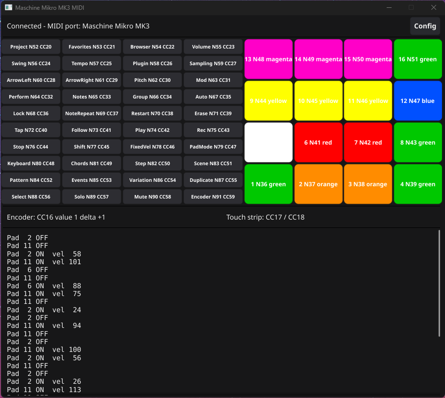
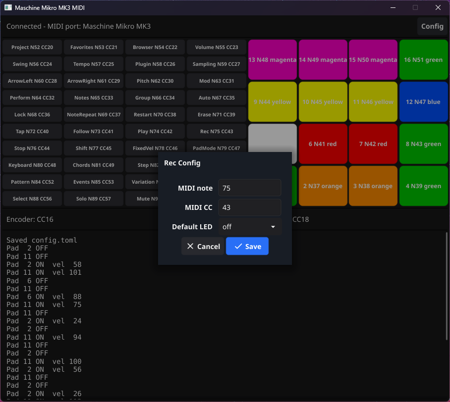
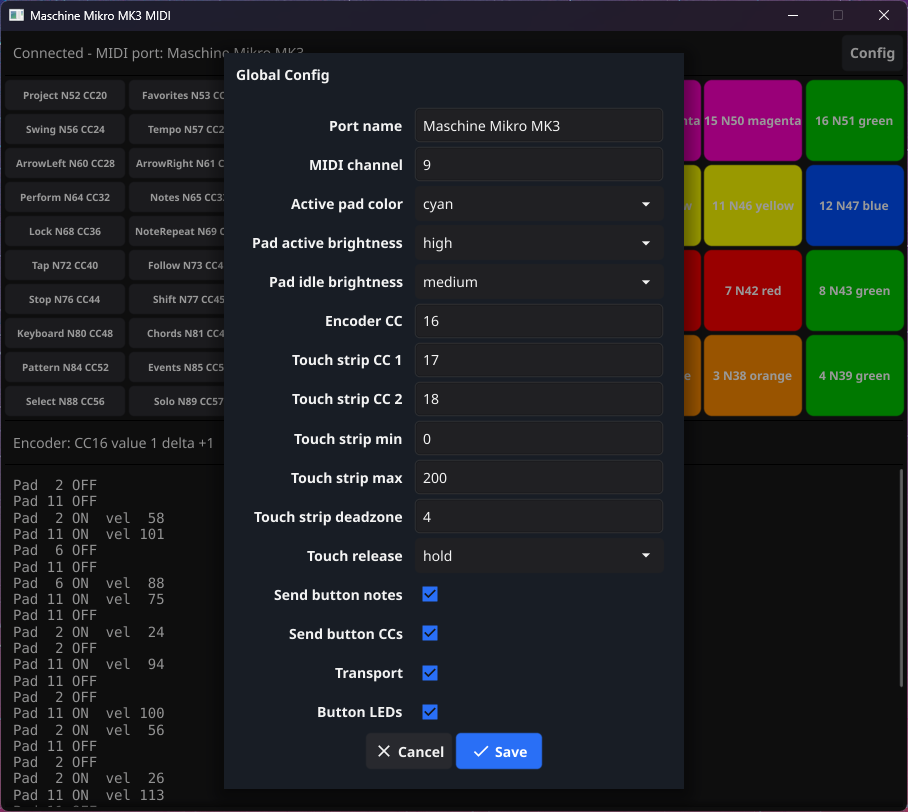

# Maschine Mikro MK3 MIDI Driver for Windows

Lightweight MIDI driver for the Native Instruments Maschine Mikro MK3.
No NI software required. Talks directly to the hardware over USB HID and exposes
a virtual MIDI port that any DAW can use.

Mostly AI slop, but works and gets past the hardware DRM







## Prerequisites

1. **virtualMIDI driver** - Install [loopMIDI](https://www.tobias-erichsen.de/software/loopmidi.html)
   (includes the driver). You don't need to run loopMIDI itself, just install it for the driver.

2. **Go 1.22+** with CGo enabled (only needed to build from source).

## Quick Start

```
mikro-midi.exe
```

That's it. The app will:
- Connect to your Maschine Mikro MK3 via USB
- Create a virtual MIDI port called "Maschine Mikro MK3"
- Forward pad hits as MIDI notes
- Forward button presses as MIDI notes and CCs
- Forward Play, Restart, and Stop as MIDI transport Start, Continue, and Stop
- Forward encoder turns as relative CC and touch strip movement as CC
- Keep retrying if the device is unplugged and plugged back in

Open your DAW and select "Maschine Mikro MK3" as a MIDI input device.

## Configuration

Copy `config.example.toml` to `config.toml` to customize:
- MIDI port name
- MIDI channel (default: 10 / drums)
- Pad-to-note mapping (default: GM drum map)
- Per-pad default LED colors
- Global active/idle pad LED brightness
- Button note and CC mappings
- Per-button default LED brightness (`off`, `low`, `medium`, or `high`)
- Encoder and touch strip CC numbers
- Touch strip raw min/max/deadzone calibration
- Touch strip release behavior (`hold`, `zero`, or `center`)

You can also edit configuration inside the app:
- Click a button in the GUI to edit that button
- Right-click a button to set only its default LED brightness.
- Click `Config` to edit global settings.

The app writes changes to `config.toml` automatically when you save a dialog.

## Building from Source

### On Windows

```
go build -o mikro-midi.exe .
```

### Cross-compile from WSL/Linux

Requires `gcc-mingw-w64-x86-64`:

```bash
sudo apt install gcc-mingw-w64-x86-64
make build-windows        # debug build
make release-windows      # stripped release build
```

If you do not want to install Go or mingw locally, use Docker:

```bash
make docker-build          # debug build
make docker-release        # stripped release build
```

## How It Works

The Maschine Mikro MK3 communicates over USB HID (VID `0x17cc`, PID `0x1700`).
On Windows, the device won't enter MIDI mode without NI's software. This driver
bypasses that entirely by reading raw HID reports and translating pad events to
MIDI messages, which are sent through a virtual MIDI port created via the
[virtualMIDI SDK](https://www.tobias-erichsen.de/software/virtualmidi/virtualmidi-sdk.html).

## Credits

- [essaim.dev/mikro](https://github.com/essaim-dev/mikro) - Go HID driver for the MK3
- [r00tman/maschine-mikro-mk3-driver](https://github.com/r00tman/maschine-mikro-mk3-driver) - Rust driver (protocol reference)
- [virtualMIDI SDK](https://www.tobias-erichsen.de/software/virtualmidi/) - Virtual MIDI port creation

## License

Unlicense. Do whatever you want with it.
